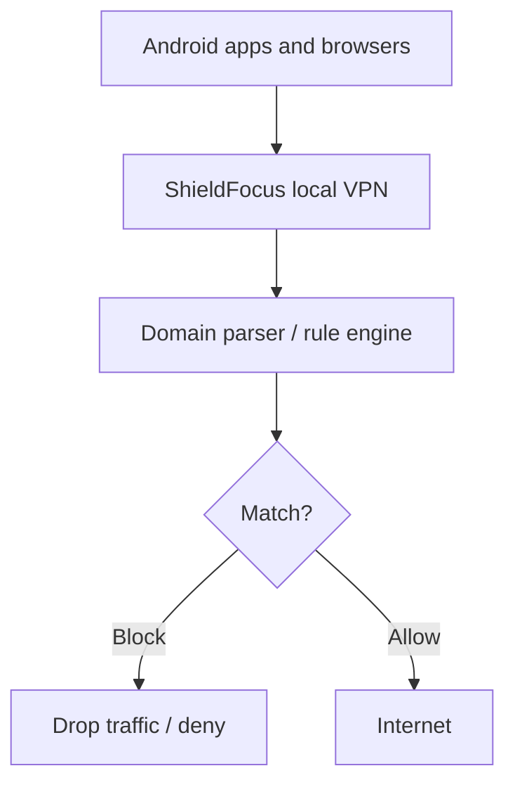

# ShieldFocus Android

ShieldFocus Android is the mobile counterpart to the desktop browser extension.
The Android version should block domains at the device network level so Chrome, Edge, Opera, Firefox, Samsung Internet, and other browsers are covered without browser-specific integrations.

## Current Status

The Android repo now includes a starter project scaffold:

- Gradle project files
- Compose UI shell
- Main activity
- VPN service stub
- Shared rule/data models

It is ready for the next implementation phase, which is the actual VPN tunnel and domain filtering logic.

## Core Decision

Use a local `VpnService`-based filter.

That gives us:

- On-device domain filtering
- Browser coverage across the whole device
- No need to connect to each browser separately
- A privacy-preserving story that keeps traffic local

## What Reuses Well

The Android app can reuse the same concepts from the extension:

- Default blocked-domain list
- User blocklist and allowlist
- Categories
- Schedules
- Settings
- Decision logging
- Domain normalization and matching

## What Does Not Reuse Directly

The browser extension pieces do not transfer as-is:

- `chrome.declarativeNetRequest`
- content scripts
- Chrome service workers
- `chrome.runtime.sendMessage`
- popup/options pages built for the browser extension

## First Android Version

Start with a modest, reliable v1:

- Local VPN filter
- DNS/domain parsing
- Default blocklist
- Custom blocked domains
- Allowlist
- Schedule-aware decisions
- Local DataStore or Room persistence
- Foreground service notification
- Simple block/activity log

## Important Limitation

The desktop extension can inspect page metadata after load.
The Android app should not promise that in v1.

With HTTPS traffic, a VPN-based filter can reliably see network destinations, but it should not try to read titles, keywords, or visible text without crossing into intrusive territory.

So Android v1 should focus on:

- Known domain blocking
- Custom blocklists
- Allowlists
- Schedules
- Category lists
- Optional DNS-based classification

## Strict Blocking: Current Coverage and Limitations

Strict Mode currently strengthens domain filtering by:

- Blocking exact domains and all of their subdomains
- Detecting the same site label across alternative top-level domains
- Detecting common numbered, mirror, proxy, official, and unblocked variants
- Intercepting IPv4 DNS requests sent to the device resolver and a bounded set of well-known public resolvers
- Restarting the VPN automatically when Strict Mode changes so the new routes and policy take effect
- Supporting Android Always-on VPN and the system's **Block connections without VPN** lockdown option

Strict Mode is deliberately implemented without a default VPN route. The current tunnel understands IPv4 UDP DNS packets; routing all device traffic into it would drop unsupported TCP, IPv6, and general application traffic.

The following bypasses or limitations remain:

- **Unknown DNS-over-HTTPS providers:** ShieldFocus fails closed for encrypted connections to the known resolver IPs it routes, but an app can use another DoH provider or relay that is not yet known to ShieldFocus.
- **IPv6 DNS:** The current packet codec and response builder support IPv4 UDP DNS only. IPv6 resolver traffic is not yet intercepted.
- **DNS over TCP:** DNS clients that fall back to TCP are not currently forwarded by the tunnel.
- **Direct-IP access:** A connection made directly to a server IP may not reveal a hostname, so it cannot be classified reliably by the domain policy.
- **Changing aliases:** Adult sites can introduce unrelated mirror names that contain no recognizable blocked-domain label. Updated curated lists are still required.
- **Explicit allow rules:** A custom allow rule intentionally takes precedence over strict domain-family blocking.

### Strict Blocking Roadmap

Implement these as separate, tested phases to avoid breaking device connectivity:

1. Add IPv6 UDP DNS parsing, blocking responses, routes, and packet-level tests.
2. Add DNS-over-TCP handling for routed resolver addresses.
3. Maintain an updateable local list of known DoH resolver hostnames and IP addresses.
4. Detect and fail closed on unsupported encrypted-DNS traffic only when Strict Mode is enabled.
5. Evaluate a full dual-stack traffic-forwarding tunnel for hostname-to-IP correlation and direct-IP enforcement.
6. Add authentication around custom allow rules and protection changes when Protection Lock is enabled.

Do not claim that ShieldFocus blocks every possible endpoint until the dual-stack and encrypted-DNS phases are complete. Android Always-on VPN with **Block connections without VPN** should remain the recommended strongest configuration.

## Avoid For v1

These are not the foundation for ShieldFocus Android:

- Accessibility Service as the main browser inspection method
- Installing a certificate to decrypt HTTPS traffic
- Per-browser integrations

## Suggested Stack

- Kotlin
- Jetpack Compose
- VpnService
- DataStore or Room
- Foreground service for protection status

## Architecture

## Roadmap

### Phase 1

- Android project skeleton
- Local VPN service
- Rule engine
- Settings storage
- Basic notification

### Phase 2

- Default blocklist support
- User blocklist and allowlist
- Schedule support
- Decision logging

### Phase 3

- Better UI
- Import/export
- Category management
- Persistent startup behavior

### Phase 4

- Optional advanced classification
- Store-readiness checks
- Policy review for Google Play

## Store Notes

Google Play will require the VPN service use to be declared clearly.
The app must explain that the VPN is used for local on-device filtering and not for routing traffic through ShieldFocus servers.

## Product Strategy

- Desktop extension: richer page behavior and browser-level controls
- Android app: device-wide domain filtering
- Shared rule format: same lists, same categories, same schedules, same settings concept
